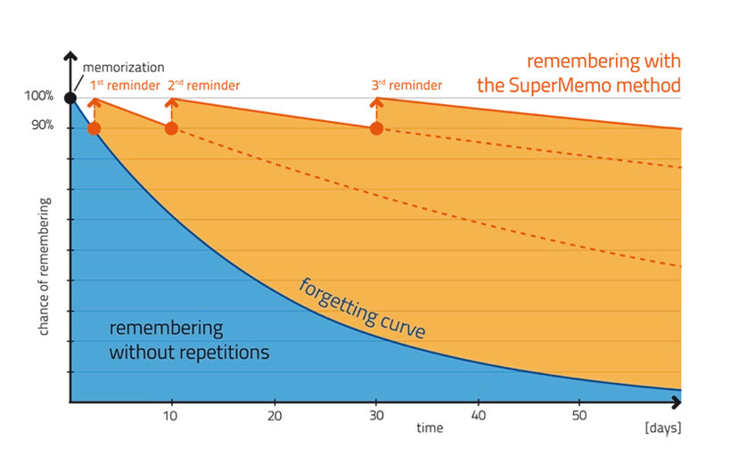

Command Line Spaced Repetition
=================

This is a command line spaced repetition program written in Javascript using Node.js.

**Please note:** The original version of this repository was created by [Joe Del](https://github.com/joedel). Since inactive, I have copied the repository over and will continue to improve the application. This repository encapsulates my personal changes to the original application (adding language decks/features).

[Spaced repetition](http://en.wikipedia.org/wiki/Spaced_repetition) is a learning technique that incorporates increasing intervals of time between subsequent review of 
previously learned material in order to exploit the psychological spacing effect.
It is very useful for learning a new language or specific sets of information.

**Basically, information you know well is shown less often and information you don't know well is shown more often.**

The algorithm implemented in this app is the SM-2 algorithm used in the SuperMemo-2 software as well as the popular 
open source Anki software. The algorithm is described in detail here: https://www.supermemo.com/en/archives1990-2015/english/ol/sm2

To run
------
- Make sure you have [Node.js](http://nodejs.org) installed.
- Clone the repo and create your word list (see `cardsExample.json`)
- Navigate to `spaced.js` and change the language variable to "Example"
- On the command line run: 
    - `node spaced.js`

Add cards via the command line
------

- If you prefer to add cards via the command line rather than editting the raw JSON file you can run:
    - `node addCards.js`

Here you will be able to add new cards to a specified deck. You can also provide examples (delimited by underscores). Each example will be shown along with the answer in spaced repetition practice.
